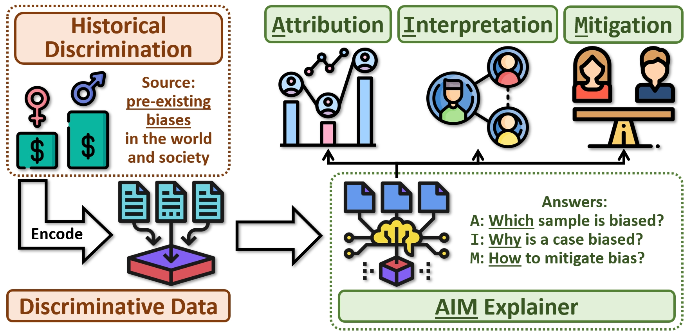
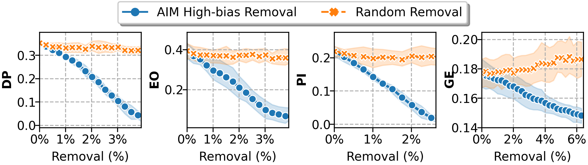
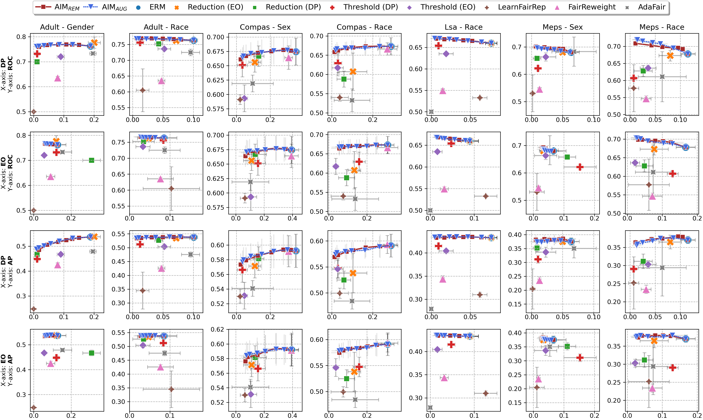
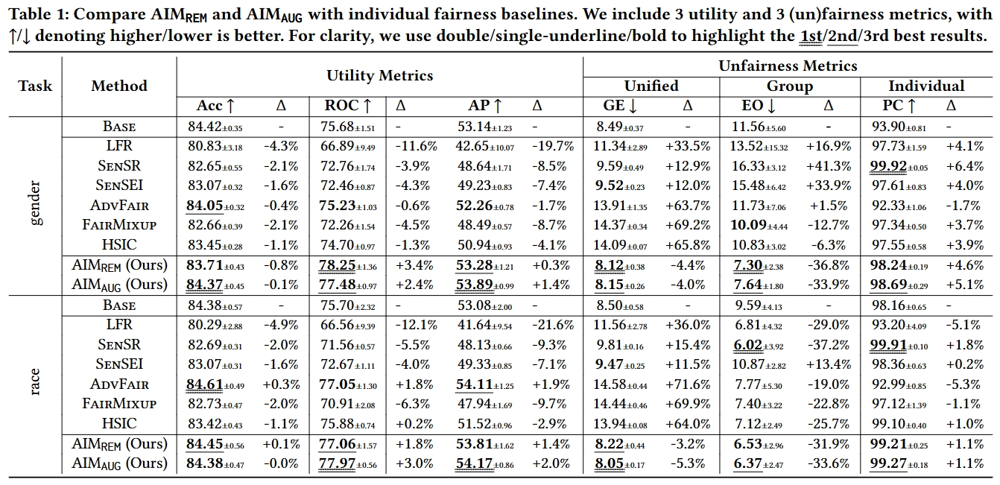

<h1 align="center">
🎯AIM: Attributing, Interpreting, Mitigating Data Unfairness [KDD'24]
</h1>

  
  
  
  
  

🎯AIM (bias Attribution, Interpretation, Mitigation) is a framework for more **transparent**, **auditable**, and **efficient** **fair machine learning** (**FairML**).
It aims to assist FairML researcher and practitioners in addressing the following problems:

- 🧐**Attribution**: **Which** sample carries bias and contribute to unfairness?
- 🤔**Interpretation**: **Why** is a particular sample biased (i.e., reflecting discrimination)?
- 🤗**Mitigation**: **How** to counter unfairness with auditable data editing and minimal utility loss?

As of now, we provide the development scripts in the `src` directory.
We will clean and refactor the codebase, but may take some time (due to limited bandwidth), please stay tuned for the updates.

<!-- ## 📚Citation -->

## Table of Contents
- [Table of Contents](#table-of-contents)
- [📖Introduction](#introduction)
    - [Background \& Motivation](#background--motivation)
    - [Why AIM?](#why-aim)
- [📊Main Results](#main-results)
  - [AIM Attribution](#aim-attribution)
  - [AIM Mitgation](#aim-mitgation)
    - [AIM for Mitigating Group Unfairness](#aim-for-mitigating-group-unfairness)
    - [AIM for Mitigating Individual Unfairness](#aim-for-mitigating-individual-unfairness)

## 📖Introduction

#### Background & Motivation
Data collected in the real world often encapsulates historical discrimination against disadvantaged groups and individuals. Existing fair machine learning (FairML) research has predominantly focused on mitigating discriminative bias in the model prediction, with far less effort dedicated towards exploring how to trace biases present in the data, despite its importance for the transparency and interpretability of FairML. 

#### Why AIM?
To fill this gap, we investigate a novel research problem: discovering samples that reflect biases/prejudices from the training data. Grounding on the existing fairness notions, we lay out a sample bias criterion and propose practical algorithms for measuring and countering sample bias. The derived bias score provides intuitive sample-level attribution and explanation of historical bias in data. On this basis, we further design two FairML strategies via sample-bias-informed minimal data editing. They can mitigate both group and individual unfairness at the cost of minimal or zero predictive utility loss. Extensive experiments and analyses on multiple real-world datasets demonstrate the effectiveness of our methods in explaining and mitigating unfairness. Code is available at https://github.com/ZhiningLiu1998/AIM.

## 📊Main Results

### AIM Attribution

We validate the soundness of AIM unfair attribution by verifying whether the high-bias samples identified by AIM encode discriminatory information from the data, and contribute to the unfairness in model predictions.

Specifically, we remove varying quantities of samples with high to low bias scores from the training dataset of compas and observe the (un)fairness metrics of the model trained on the modified data.
We compare these results with a na\"ive method that randomly remove samples from training data.
Results are shown in Figure below.
To ensure a comprehensive evaluation, we include DP and EO for group unfairness, Predictive Inconsistency (PI, i.e., 1 - PC) for individual unfairness, and GE for both.

It can be observed that randomly removing samples does not alleviate the model's unfairness. 
At the same time, removing an equal number of high-bias samples identified by AIM significantly reduces the encoded discriminatory information in the data, and effectively promotes both group and individual fairness in model predictions.
This verifies the rationality of AIM unfair attribution.

### AIM Mitgation

Two Attribution-Informed Unfairness Mitigation strategies:
- AIM$_\text{REM}$: via Unfair Sample Removal
- AIM$_\text{AUG}$: via Fair Sample Augmentation

#### AIM for Mitigating Group Unfairness

**Setting**:
Compare AIM$_\text{REM}$ and AIM$_\text{AUG}$ with group fairness baselines.
We show the trade-off between utility (x-axis) and unfairness metrics (y-axis) on 4 real-world FairML tasks.
Results close to the upper-left corner have better trade-offs, i.e., with low unfairness (x-axis) and high utility (y-axis).
Each column corresponds to a FairML task, and each row corresponds to a utility-unfairness metric pair.
As AIM's utility-unfairness trade-off can be controlled by the sample removal/augmentation budget, we show its performance with line plots. 
We show error bars for both utility and unfairness metrics.

In short (see the figure below):
- AIM$_\text{REM}$ and AIM$_\text{AUG}$ outperform 7 FairML baselines in most cases.
- Both can mitigate group unfairness with minimal/zero utility cost.
- Some baselines, while can help with certain fairness metrics, may hurt others.

#### AIM for Mitigating Individual Unfairness

**Setting**:
We further verify the effectiveness of AIM in promoting individual fairness (IF).
6 FairML baselines that mitigate individual unfairness are included: LearnFairRep (LFR), SenSR, SenSEI, AdvFair, FairMixup, HSIC.
Since these methods generally rely on gradient-based optimization, we use neural networks as the base ML model in this section.
Following the existing literature, We test them on the widely used *Adult* dataset, with gender and race being the sensitive attribute, respectively.
To ensure a comprehensive evaluation, we adopt three utility metrics (ACC, ROC, AP) and three metrics for individual and/or group (un)fairness: PC for individual, EO for group, and GE for both.
For AIM$_\text{REM}$ and AIM$_\text{AUG}$, we select the sample removal/augmentation budget that maximizes PC (individual fairness) on the validation set.

In short (see the table below):
- AIM$_\text{REM}$ and AIM$_\text{AUG}$ simultaneously promote both individual and group fairness.
- Compared to baselines, AIM exhibits significantly less (if any) utility losses.
- Baseline FairML methods devised for individual fairness can potentially lead to group unfairness.

